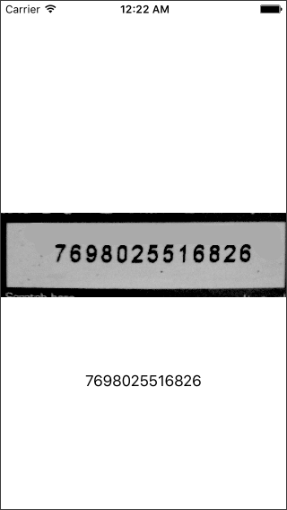

###iOS-Tesseract example
A simple project that shows you how to 
use Tesseract on iOS using Swift

**Library used**

* [Tesseract-OCR-iOS](https://github.com/gali8/Tesseract-OCR-iOS)





```swift
        let tesseract: G8Tesseract = G8Tesseract(language: "eng")
        tesseract.engineMode = .TesseractOnly
        //tesseract.pageSegmentationMode = .Auto
        tesseract.charWhitelist = "@.(){}/\\!*&#0123456789abcdefghijklmnopqrstuvwxyzABCDEFGHIJKLMNOPQRSTUVWXYZ";
        //tesseract.charWhitelist = "0123456789";
        //tesseract.charBlacklist = "@.(){}/\\!*&#abcdefghijklmnopqrstuvwxyzABCDEFGHIJKLMNOPQRSTUVWXYZ"

        tesseract.maximumRecognitionTime = 10.0
        
        tesseract.delegate = self
        
        
        let ocrSample = UIImage(named: "Image5")
        tesseract.image = ocrSample?.fixOrientation().g8_blackAndWhite()
        
        tesseract.recognize()

        let recognizedText = tesseract.recognizedText
        
        print("recognizedText: \(recognizedText)")
        
        ocrSampleImage.image = tesseract.image
        orcText.text = recognizedText
```